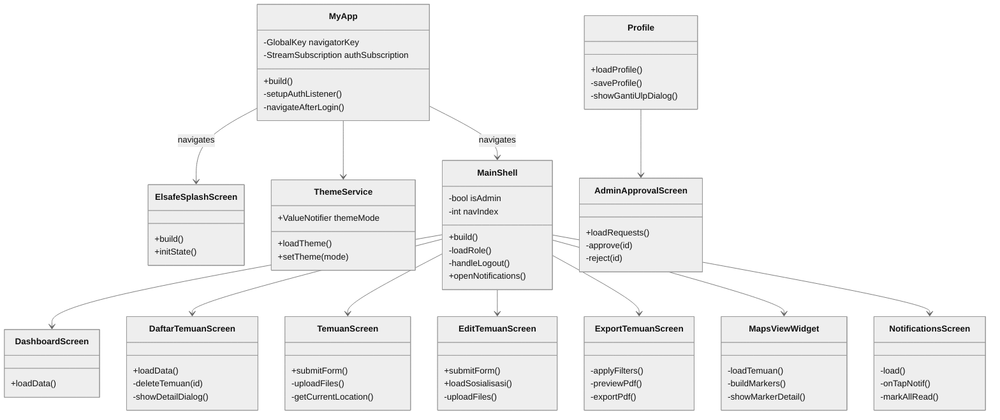
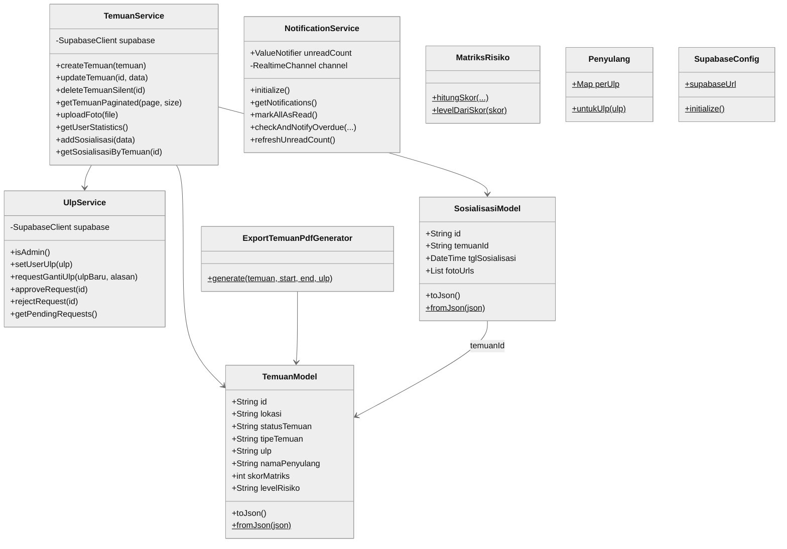
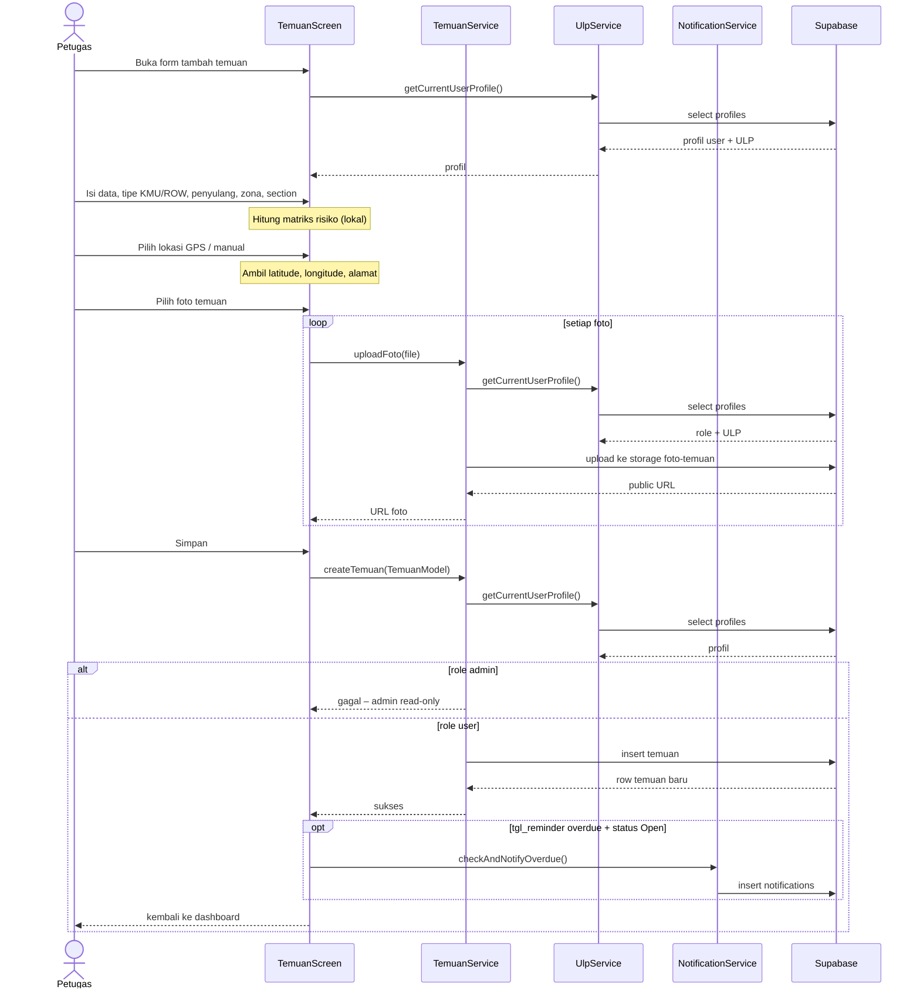
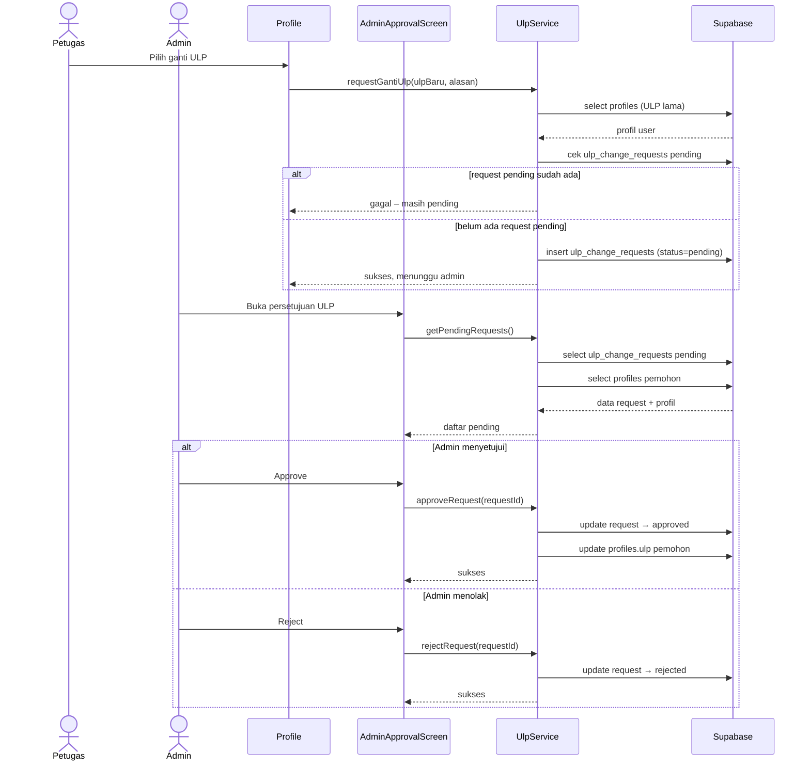
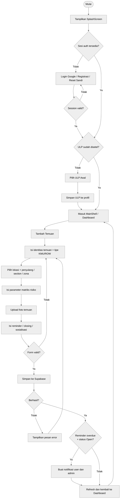
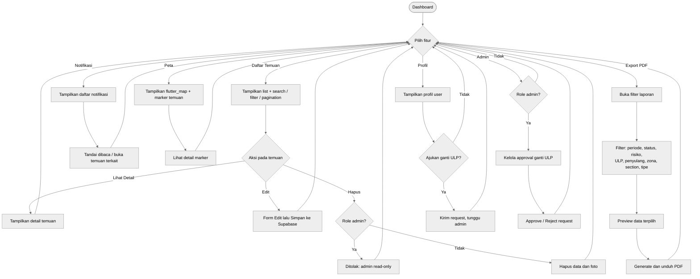
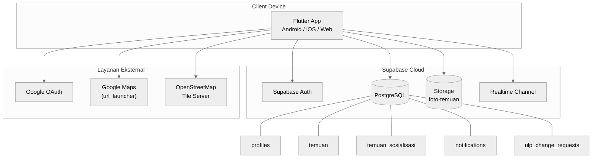
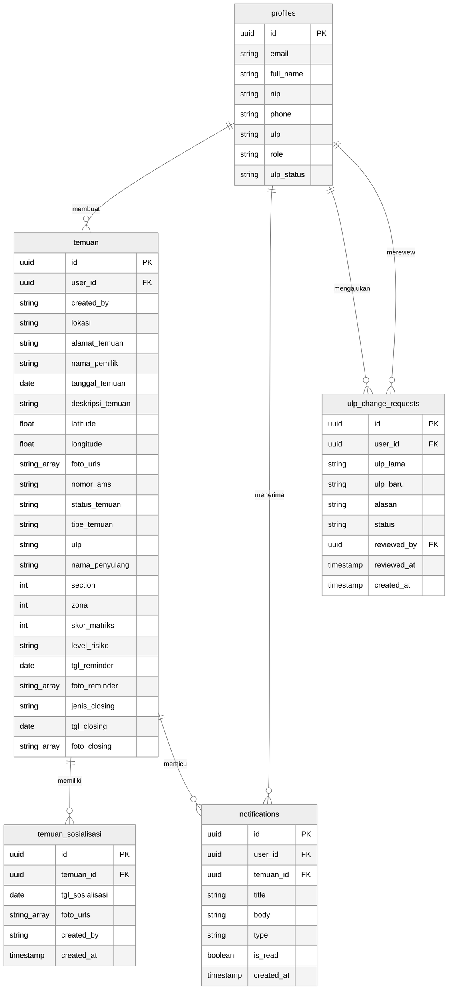
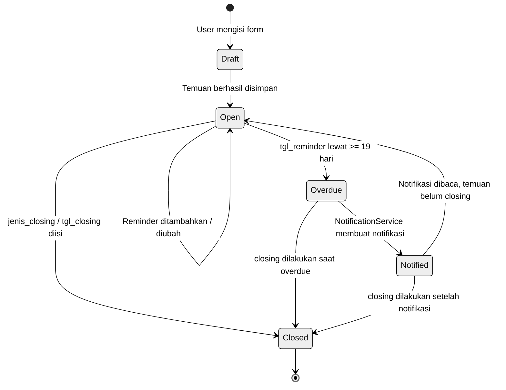

# Diagram UML Aplikasi Elsafe

Dokumen ini disusun dari graphify `GRAPH_REPORT.md` dan pembacaan modul inti aplikasi Flutter/Supabase. Fokus sistem adalah pencatatan, pemantauan, tindak lanjut, notifikasi, pemetaan, dan export laporan temuan potensi bahaya KMU/ROW.

> **Catatan Format:** Semua diagram menggunakan tema `neutral` dan arah `TB`/`TD` agar sesuai orientasi *portrait* kertas A4. Class diagram dan activity diagram masing-masing dibagi dua bagian agar setiap gambar cukup dalam satu halaman A4.

## Ringkasan Aktor dan Modul

Aktor utama:
- Petugas/User: login, memilih ULP, membuat dan mengelola temuan, mengunggah foto, mengisi reminder/closing/sosialisasi, melihat peta, dan export laporan.
- Admin: melihat seluruh temuan, menerima notifikasi, dan menyetujui/menolak permintaan perubahan ULP. Pada kode saat ini admin bersifat read-only untuk data temuan.
- Supabase: layanan eksternal untuk Auth, database, storage foto, dan realtime notification.
- Google OAuth/Maps: layanan eksternal untuk autentikasi OAuth dan pembukaan lokasi peta (via url_launcher).

Modul inti:
- `MyApp`, `ElsafeSplashScreen`, `LoginPage`, `RegisterPage`, `NewPasswordPage`, `UlpSelectionScreen`
- `MainShell`, `DashboardScreen`, `DaftarTemuanScreen`, `TemuanScreen`, `EditTemuanScreen`
- `MapsViewWidget`, `NotificationsScreen`, `ExportTemuanScreen`, `AdminApprovalScreen`, `Profile`
- `TemuanService`, `UlpService`, `NotificationService`, `ThemeService`
- `TemuanModel`, `SosialisasiModel`, `TipeTemuan`, `MatriksRisiko`, `Penyulang`
- `filterExportTemuan`, `ExportTemuanPdfGenerator`
- `DashboardDrawer`, `PanduanPenggunaanScreen` (widget bantu di MainShell)

---

## 1. Use Case Diagram

```mermaid
%%{init: {'theme': 'neutral'}}%%
flowchart TB
  petugas([Petugas / User])
  admin([Admin])

  subgraph sistem["Sistem Elsafe"]
    subgraph grpAuth["Autentikasi"]
      ucLogin([Login Google])
      ucRegister([Registrasi])
      ucReset([Reset Sandi])
      ucPilihUlp([Pilih ULP Awal])
    end

    subgraph grpTemuan["Pengelolaan Temuan"]
      ucDashboard([Dashboard])
      ucTambah([Buat Temuan])
      ucDaftar([Daftar Temuan])
      ucDetail([Detail Temuan])
      ucEdit([Edit Temuan])
      ucHapus([Hapus Temuan])
    end

    subgraph grpSub["Sub-Proses Temuan"]
      ucUpload([Upload Foto])
      ucRisiko([Matriks Risiko])
      ucLokasi([Pilih Lokasi])
      ucReminder([Reminder])
      ucClosing([Closing])
      ucSosialisasi([Sosialisasi])
    end

    subgraph grpMonitor["Monitoring dan Output"]
      ucNotif([Notifikasi])
      ucMaps([Peta Temuan])
      ucExport([Export PDF])
      ucPanduan([Panduan])
    end

    subgraph grpProfil["Profil"]
      ucProfil([Profil])
      ucReqUlp([Ajukan Ganti ULP])
    end

    subgraph grpAdmin["Fitur Admin"]
      ucApprove([Approval Ganti ULP])
      ucReadOnly([Lihat Temuan])
    end
  end

  supabase[(Supabase)]
  google[Google OAuth / Maps]

  petugas --> ucLogin & ucRegister & ucReset & ucPilihUlp
  petugas --> ucDashboard & ucTambah & ucDaftar & ucDetail & ucEdit & ucHapus
  petugas --> ucNotif & ucMaps & ucExport & ucProfil & ucReqUlp & ucPanduan

  admin --> ucLogin & ucDashboard & ucReadOnly
  admin --> ucNotif & ucExport & ucApprove & ucPanduan

  ucTambah -.->|include| ucUpload
  ucTambah -.->|include| ucRisiko
  ucTambah -.->|include| ucLokasi
  ucTambah -.->|include| ucReminder
  ucEdit -.->|include| ucClosing
  ucEdit -.->|include| ucSosialisasi
  ucEdit -.->|include| ucUpload

  ucLogin --> google & supabase
  ucLokasi & ucMaps --> google
  ucRegister & ucReset & ucPilihUlp --> supabase
  ucTambah & ucUpload & ucDaftar & ucEdit & ucHapus --> supabase
  ucNotif & ucReqUlp & ucApprove & ucExport --> supabase
```

---

## 2a. Class Diagram – Layer UI

---

## 2b. Class Diagram – Layer Service dan Model

---

## 3. Sequence Diagram – Membuat Temuan

---

## 4. Sequence Diagram – Request Ganti ULP dan Approval Admin

---

## 5a. Activity Diagram – Alur Autentikasi dan Tambah Temuan

---

## 5b. Activity Diagram – Alur Fitur Pendukung

---

## 6. Deployment / Component Diagram

Catatan implementasi:
- Peta dalam aplikasi menggunakan `flutter_map` + tile OpenStreetMap (bukan Google Maps SDK).
- Tombol "Buka Maps" membuka Google Maps melalui `url_launcher` (external app/browser).

---

## 7. Entity Relationship Diagram

---

## 8. State Machine Diagram – Status Temuan

---

## Catatan Diagram untuk Skripsi

Diagram yang sudah tersedia dalam dokumen ini:

| No | Diagram | Keterangan |
|----|---------|-----------|
| 1 | Use Case Diagram | Aktor, use case, relasi include, layanan eksternal |
| 2a | Class Diagram – Layer UI | Screen, shell, widget; metode publik utama |
| 2b | Class Diagram – Layer Service & Model | Service, model, helper; relasi dependensi |
| 3 | Sequence – Membuat Temuan | Alur lengkap buat temuan + notifikasi overdue |
| 4 | Sequence – Ganti ULP & Approval | Request user → approval/reject admin |
| 5a | Activity – Autentikasi & Tambah Temuan | Login, pilih ULP, buat temuan, error handling |
| 5b | Activity – Fitur Pendukung | Daftar, notifikasi, peta, export, profil, admin |
| 6 | Deployment / Component | Flutter ↔ Supabase ↔ layanan eksternal |
| 7 | ERD | Skema tabel PostgreSQL dan relasi antar tabel |
| 8 | State Machine – Status Temuan | Transisi Draft → Open → Overdue → Closed |

Rekomendasi prioritas untuk skripsi Teknik Informatika:
- **Wajib:** Use Case Diagram, Activity Diagram (5a+5b), Sequence Diagram, Class Diagram (2a+2b), ERD.
- **Sangat disarankan:** Deployment/Component Diagram.
- **Opsional tetapi kuat:** State Machine Diagram status temuan.
