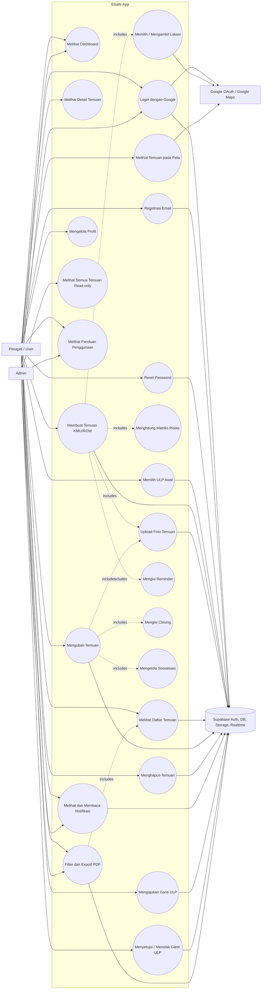
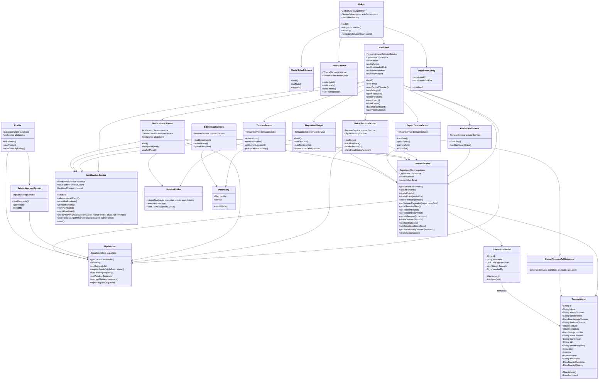
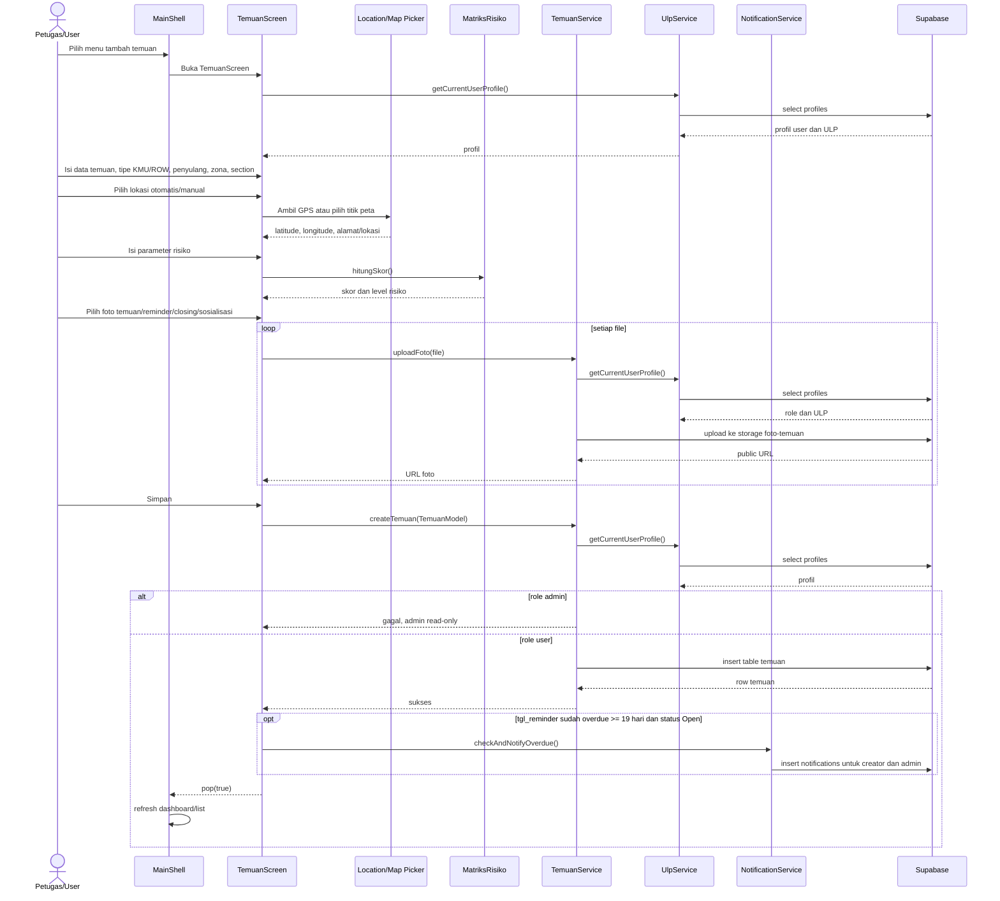
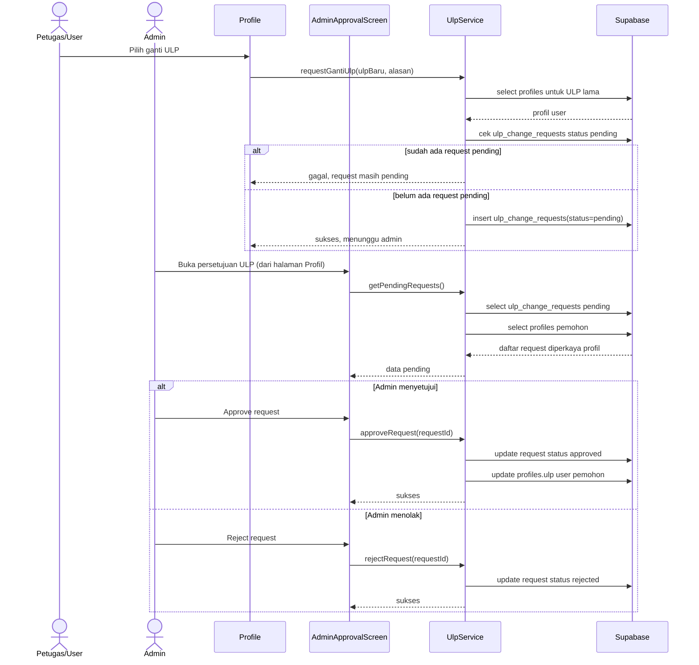
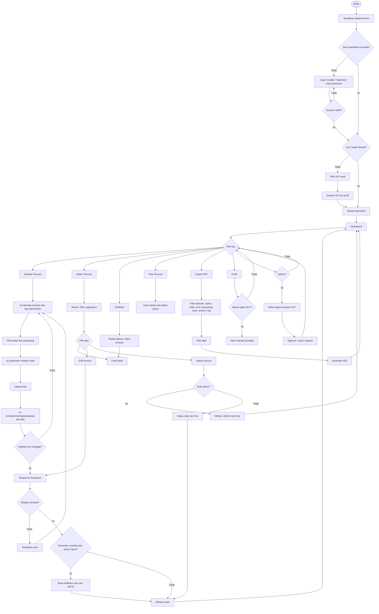
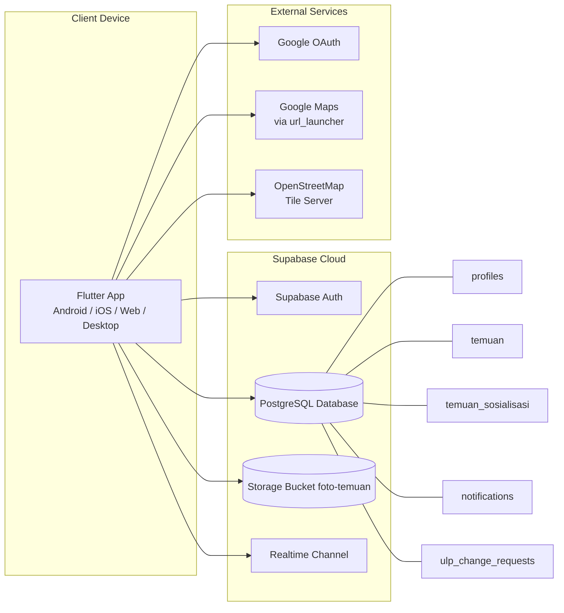
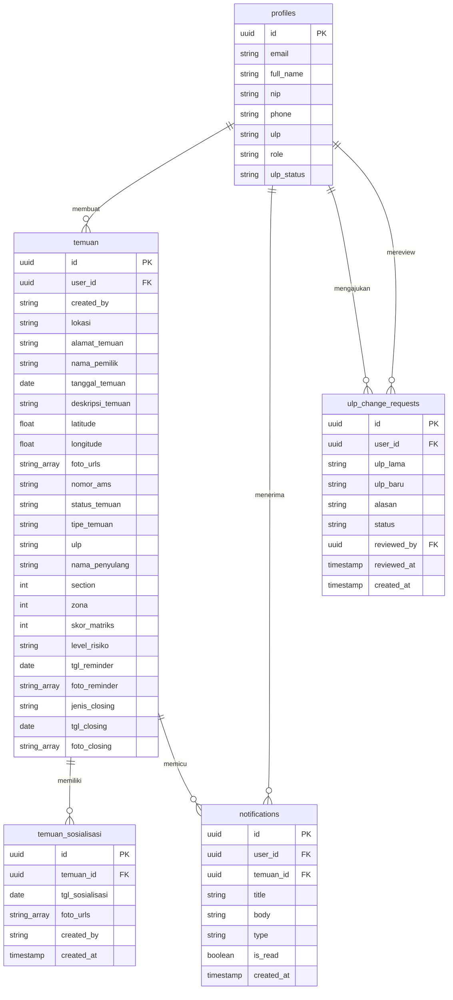
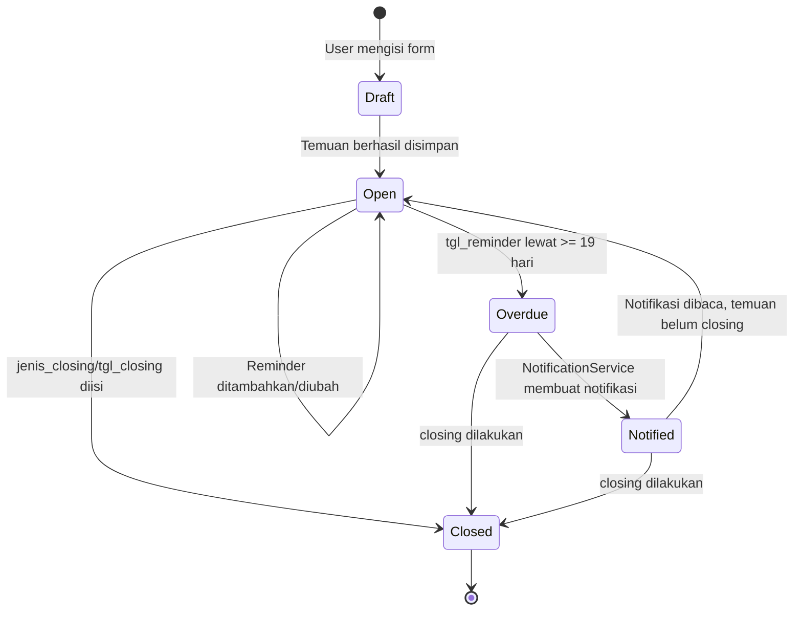

# Diagram UML Aplikasi Elsafe

Dokumen ini disusun dari graphify `GRAPH_REPORT.md` dan pembacaan modul inti aplikasi Flutter/Supabase. Fokus sistem adalah pencatatan, pemantauan, tindak lanjut, notifikasi, pemetaan, dan export laporan temuan potensi bahaya KMU/ROW.

## Ringkasan Aktor dan Modul

Aktor utama:
- Petugas/User: login, memilih ULP, membuat dan mengelola temuan, mengunggah foto, mengisi reminder/closing/sosialisasi, melihat peta, dan export laporan.
- Admin: melihat seluruh temuan, menerima notifikasi, dan menyetujui/menolak permintaan perubahan ULP. Pada kode saat ini admin bersifat read-only untuk data temuan.
- Supabase: layanan eksternal untuk Auth, database, storage foto, dan realtime notification.
- Google OAuth/Maps: layanan eksternal untuk autentikasi OAuth dan pembukaan lokasi peta (via url_launcher).

Modul inti:
- `MyApp`, `ElsafeSplashScreen`, `LoginPage`, `RegisterPage`, `NewPasswordPage`, `UlpSelectionScreen`
- `MainShell`, `DashboardScreen`, `DaftarTemuanScreen`, `TemuanScreen`, `EditTemuanScreen`
- `MapsViewWidget`, `NotificationsScreen`, `ExportTemuanScreen`, `AdminApprovalScreen`, `Profile`
- `TemuanService`, `UlpService`, `NotificationService`, `ThemeService`
- `TemuanModel`, `SosialisasiModel`, `TipeTemuan`, `MatriksRisiko`, `Penyulang`
- `filterExportTemuan`, `ExportTemuanPdfGenerator`
- `DashboardDrawer`, `PanduanPenggunaanScreen` (widget bantu di MainShell)

## 1. Use Case Diagram

## 2. Class Diagram

## 3. Sequence Diagram - Membuat Temuan

## 4. Sequence Diagram - Request Ganti ULP dan Approval Admin

## 5. Activity Diagram - Workflow Pengelolaan Temuan

## 6. Deployment / Component Diagram

Diagram ini menjelaskan komponen-komponen utama dan layanan eksternal yang digunakan aplikasi.

Catatan implementasi:
- Peta dalam aplikasi menggunakan `flutter_map` + tile OpenStreetMap (bukan Google Maps SDK).
- Tombol "Buka Maps" membuka Google Maps melalui `url_launcher` (external app/browser).

## 7. Entity Relationship Diagram

## Diagram Tambahan untuk Skripsi

Diagram yang sebaiknya ditambahkan selain empat UML utama:

1. ERD / Database Schema Diagram: penting karena aplikasi sangat bergantung pada tabel `profiles`, `temuan`, `temuan_sosialisasi`, `notifications`, dan `ulp_change_requests`.
2. Component Diagram: menunjukkan pembagian Flutter App, Supabase Auth, Database, Storage, Realtime, Google OAuth, OpenStreetMap, dan Google Maps.
3. Deployment Diagram: menjelaskan aplikasi berjalan di perangkat client dan berkomunikasi dengan Supabase Cloud serta layanan eksternal.
4. State Machine Diagram untuk status temuan: cocok untuk menjelaskan transisi `Open` ke `Closed`, serta kondisi reminder overdue.
5. Wireframe atau Navigation Flow: berguna di bab perancangan antarmuka untuk menjelaskan alur dari splash screen, login, dashboard, tambah temuan, daftar, peta, notifikasi, export, dan profil.

Rekomendasi prioritas untuk skripsi Teknik Informatika:
- Wajib: Use Case Diagram, Activity Diagram, Sequence Diagram, Class Diagram, ERD.
- Sangat disarankan: Component/Deployment Diagram.
- Opsional tetapi kuat: State Machine Diagram status temuan dan Navigation Flow.

## State Machine Diagram Tambahan - Status Temuan

